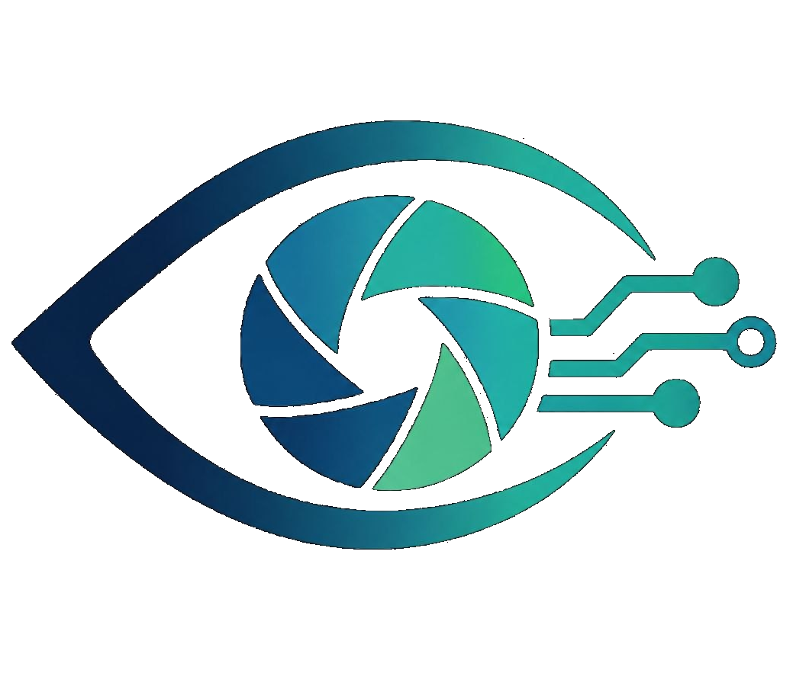
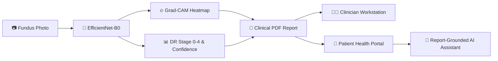

<div align="center">

  

  # MedVisionAI

  ### *Screen Earlier. Explain Better. Reach Further.*

  **Point-of-Care Explainable AI System for Diabetic Retinopathy Screening & Clinical Triage**

  [](https://fastapi.tiangolo.com/)
  [](https://pytorch.org/)
  [](https://react.dev/)
  [](https://vitejs.dev/)
  [](https://tailwindcss.com/)
  [](https://captum.ai/)
  [](LICENSE)

</div>

---

## 📖 The Story

### 01. The Human Stakes
> **Diabetic retinopathy is preventable blindness. Screening for it usually isn’t.**

Over **3.9 million people worldwide** suffer from irreversible vision loss caused by Diabetic Retinopathy (DR). When detected early, **90%+ of severe vision loss is entirely preventable**. 

Yet, conventional screening requires dilated fundus examinations performed by specialized ophthalmologists using expensive, hospital-grade fundus cameras. Because community health centers and primary care clinics rarely have access to these resources, early microvascular lesions—microaneurysms, hemorrhages, and hard exudates—routinely go undetected until irreversible retinal damage has already occurred.

```
       [ Status Quo: Overburdened Specialty Pipeline ]
  Primary Clinic ──(Long Waitlist)──> Ophthalmology Queue ──> Delayed Diagnosis ──> Vision Loss

       [ MedVisionAI: Frontline Point-of-Care Triage ]
  Primary Clinic ──(60s AI + Grad-CAM)──> Stratified Triage ──> Timely Specialist Intervention
```

---

### 02. The Trust Problem
> **In clinical medicine, a black-box percentage is not enough.**

A **94% confidence score alone** does not give an attending clinician enough justification to initiate a specialist referral. Did the neural network identify authentic microvascular pathology near the macula, or was it influenced by optical dust or lighting artifacts at the edge of the photograph?

**MedVisionAI solves the trust gap by coupling deep learning inference with layer-level Gradient-weighted Class Activation Mapping (Grad-CAM).** Healthcare workers and consulting clinicians can visually verify whether the model’s focal attention correlates with authentic physiological lesions before taking clinical action.

---

## ✨ Core Capabilities



### 🩺 1. Clinical Workstation (`/worker/dashboard`)
* **Instant Neural Inference**: Evaluates digital fundus photographs in seconds using a fine-tuned PyTorch `EfficientNet-B0` architecture across 5 International Clinical Diabetic Retinopathy (ICDR) severity levels:
  * `Stage 0`: No Diabetic Retinopathy
  * `Stage 1`: Mild Non-Proliferative DR
  * `Stage 2`: Moderate Non-Proliferative DR
  * `Stage 3`: Severe Non-Proliferative DR
  * `Stage 4`: Proliferative DR
* **Visual Explainability (Grad-CAM)**: High-resolution thermal activation overlays showing exact pixel regions influencing the prediction.
* **Comprehensive Patient Onboarding**: Register patients with rich biodata (diabetes type, year of diagnosis, existing ocular conditions, DOB).
* **Patient Directory & Status Tracking**: Live patient management with search, account status tracking (`Active` vs `Pending Activation`), and one-click structured Excel export.
* **Automated Clinical PDF Generation**: Instant generation of audit-ready diagnostic screening summaries.

### 👤 2. Patient Health Portal (`/patient/dashboard`)
* **In-Page Report Viewer**: Interactive modal PDF reader allowing patients to review their retinal screening summaries directly on their device without forced downloads.
* **Timeline & Risk Breakdown**: Simple, color-coded diagnostic summaries designed for patient clarity.
* **Report-Grounded AI Assistant**: An intelligent conversational agent backed by ChromaDB vector search that is **strictly bounded to the patient's own diagnostic report**, explaining medical findings without hallucinations.
* **Frictionless Self-Activation (`/set-password`)**: Email-independent account activation using **Email + Date of Birth verification**, enabling patients to set secure credentials on first login without requiring external email delivery infrastructure.

### 🛡️ 3. Security & Session Governance
* **Role-Based Access Control (RBAC)**: Strict separation between `DOCTOR`, `WORKER`, `SPECIALIST`, `ADMIN`, and `PATIENT` roles.
* **Autofill Credential Isolation**: Separate DOM inputs (`clinician_*` vs `patient_*`) and dynamic lifecycle keying to prevent browser password managers from cross-contaminating doctor credentials into patient fields.
* **Role-Specific Session Lifetimes**:
  * **Clinicians**: 5-minute strict inactivity security timeout for clinical compliance.
  * **Patients**: Persistent 30-day session with "Remember me" capabilities.

---

## 🏗️ Architecture & Technology Stack

| Layer | Technologies | Purpose |
|---|---|---|
| **Frontend UI / UX** | React 18, TypeScript, Vite, Tailwind CSS v4, Lucide Icons, Canvas Confetti | High-performance, responsive clinical interface with dual role-tailored dashboards. |
| **Backend API** | Python 3.10+, FastAPI, Pydantic, SQLAlchemy, Uvicorn | Async REST API, authentication middleware, and background task processing. |
| **Deep Learning & XAI**| PyTorch, Torchvision, Captum, PIL, OpenCV | Deep neural network inference (EfficientNet-B0) and Grad-CAM attention localization. |
| **Report Generation** | ReportLab, PyPDF2 | Vectorized clinical PDF report synthesis with embedded fundus images and heatmaps. |
| **Vector Search & RAG**| ChromaDB, Embeddings API / Local Transformers | Scoped document embeddings for report-grounded conversational assistant. |
| **Database** | SQLite (Dev) / PostgreSQL (Prod) | Relational storage for patient records, screenings, accounts, and clinical notes. |

---

## 🔄 Standardized Clinical Screening Pipeline

The platform enforces a four-stage screening protocol structured for clinical fidelity, operational speed, and full auditability:

```
  [01. Ingestion]        High-resolution retinal fundus photograph captured at point of care and verified for optical quality.
        │
        ▼
  [02. Inference]        EfficientNet-B0 screens retinal fields for microaneurysms, hemorrhages, and ICDR severity classification.
        │
        ▼
  [03. Explainability]   Grad-CAM heatmaps highlight pixel-level neural attention regions driving the model's triage decision.
        │
        ▼
  [04. Stratification]   Confidence-scored clinical PDF report synthesized for specialist review, doctor notes, and referral.
```

---

## 🔑 Demonstration Portals & Access Accounts

For evaluation and clinical review across the dual-role architecture:

| Role | Email Identifier | Access Portal | Primary Capabilities |
|---|---|---|---|
| **Clinician / Doctor** | `dr.screening.medvision@gmail.com` | `Clinical Workspace` | Full fundus analysis, Grad-CAM inspection, patient registry, and diagnostic PDF sign-off. |
| **Healthcare Worker** | `worker.demo@medvision.ai` | `Clinical Workspace` | Point-of-care patient intake, fundus photo upload, and preliminary triage queue access. |
| **Patient (Active)** | `priya.sharma.eye@gmail.com` | `Patient Health Portal` | Interactive in-page PDF report viewing, risk timeline, and grounded medical AI assistant. |
| **Patient (Pending)** | *Registered by Clinician* | `Account Self-Activation` | Verified identity confirmation via Email + DOB with self-service password setup. |

---

## 📁 Repository Structure

```
MedVisionAI/
├── backend/
│   ├── app/
│   │   ├── api/
│   │   │   ├── endpoints/
│   │   │   │   ├── auth.py         # Authentication & token governance
│   │   │   │   ├── screening.py    # Retinal inference & Grad-CAM pipeline
│   │   │   │   ├── patients.py     # Patient registration & directory API
│   │   │   │   ├── assistant.py    # Report-grounded RAG chatbot
│   │   │   │   └── reports.py      # PDF report generation
│   │   │   └── deps.py
│   │   ├── models/                 # SQLAlchemy ORM models
│   │   ├── schemas/                # Pydantic validation schemas
│   │   ├── services/               # Inference, XAI, RAG, & PDF services
│   │   └── main.py                 # FastAPI application root
│   ├── init_db.py                  # Database seed & initialization
│   └── requirements.txt
│
├── frontend/
│   ├── public/
│   │   └── logo.png                # Official MedVisionAI brand logo
│   ├── src/
│   │   ├── components/             # Reusable UI components & animations
│   │   ├── context/                # AuthContext & state providers
│   │   ├── pages/
│   │   │   ├── Landing.tsx         # Story-driven landing & interactive showcase
│   │   │   ├── Login.tsx           # Dual-role authenticated portal entry
│   │   │   ├── SetPassword.tsx     # DOB identity verification & activation
│   │   │   ├── WorkerDashboard.tsx # Doctor diagnostic workstation
│   │   │   ├── PatientDashboard.tsx# Patient results & PDF viewer
│   │   │   └── PatientList.tsx     # Directory & Excel export
│   │   └── services/               # Axios API client
│   └── package.json
└── README.md
```

---

## ⚖️ Clinical & Regulatory Disclaimer

> **IMPORTANT NOTICE:**  
> **MedVisionAI is an AI-assisted screening tool intended for preliminary assessment support only.** It is not an autonomous medical device and does not provide a definitive medical diagnosis. All artificial intelligence predictions, severity classifications, and Grad-CAM visual heatmaps must be reviewed and validated by a licensed healthcare professional or qualified ophthalmologist before initiating any treatment or clinical intervention.

---

<div align="center">
  <sub>Developed for frontline healthcare workers and ophthalmologists worldwide. © 2026 MedVisionAI.</sub>
</div>
